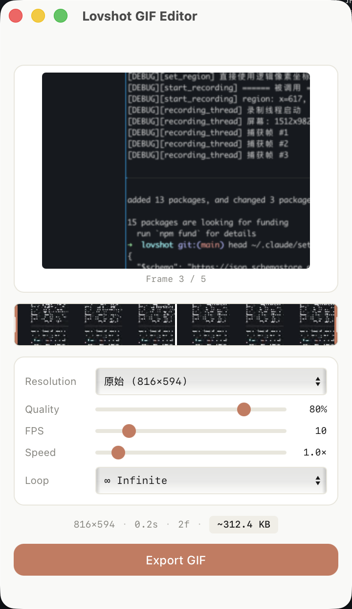

<p align="center">
  
</p>

<h1 align="center">Lovshot</h1>

<p align="center">
  <strong>Lightweight screenshot & GIF recorder for macOS</strong>
</p>

<p align="center">
  <a href="#features">Features</a> •
  <a href="#installation">Installation</a> •
  <a href="#usage">Usage</a> •
  <a href="#shortcuts">Shortcuts</a>
</p>

---

## Features

- **Region Screenshot** - Select any area, save to clipboard and disk instantly
- **GIF Recording** - Record screen regions with built-in editor for trimming
- **Scroll Capture** - Capture long pages by auto-scrolling *(experimental)*
- **Global Hotkey** - `⌥ A` activates from anywhere, no window switching
- **Menu Bar App** - Runs quietly without cluttering Dock or Cmd+Tab

## Screenshots

| Selector | GIF Editor |
|:---:|:---:|
|  |  |

## Installation

### Download

Download `.dmg` from [Releases](../../releases).

> **Note**: The app is not code-signed. If macOS shows "damaged" error, run:
> ```bash
> sudo xattr -dr com.apple.quarantine /Applications/lovshot.app
> ```

### Build from Source

```bash
git clone https://github.com/user/lovshot.git
cd lovshot
pnpm install
pnpm tauri build
```

## Usage

1. Press `⌥ A` to open selector
2. Drag to select region
3. Choose mode: 📷 Screenshot or 🎬 GIF
4. Click ✓ to confirm

### GIF Editor

After recording, the editor opens automatically:

- **Timeline Trim** - Drag handles to select export range
- **Resolution** - Original / 1080p / 720p / 480p presets
- **Frame Rate** - 5-30 fps
- **Loop Mode** - Infinite / Once / Bounce

## Shortcuts

| Key | Action |
|-----|--------|
| `⌥ A` | Open selector / Stop recording |
| `ESC` | Cancel selection |
| `Enter` | Confirm selection |
| `S` | Switch to screenshot mode |
| `G` | Switch to GIF mode |

## Tech Stack

- [Tauri 2](https://v2.tauri.app/) + Rust
- React 19 + TypeScript
- Vite

## License

MIT
